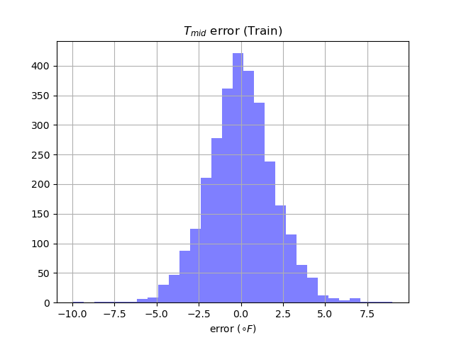
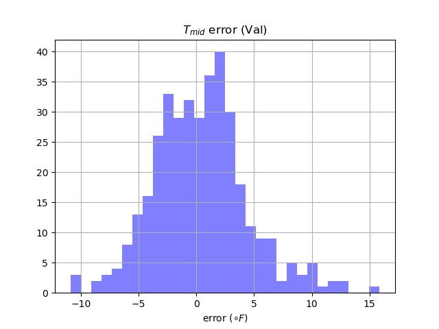
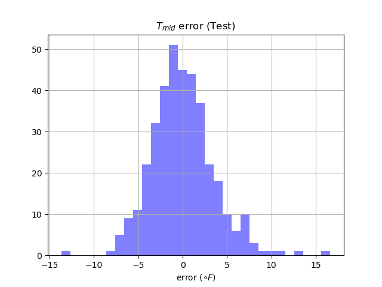
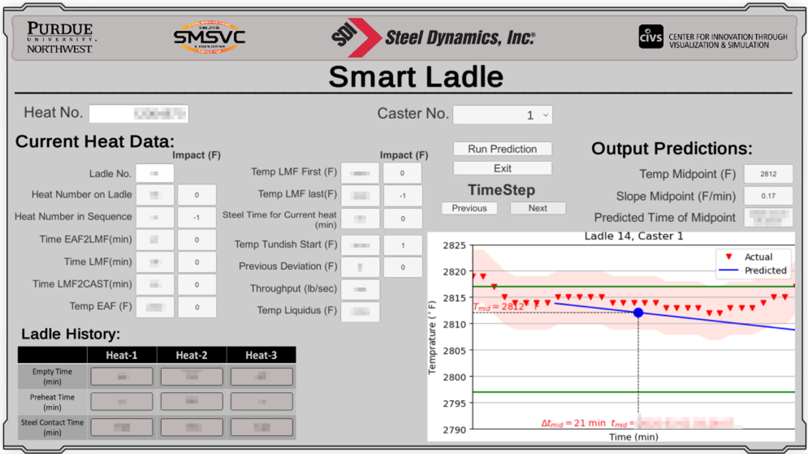

# smart ladle

## Issue
Since the ability to quantify and respond to the variables that affect steel casting temperature is crucial for achieving consistent casting quality and maximizing productivity.

We hope to develop an machine learning model using real-time and historic process data to predict future casting temperature.

For the outputs of the model, the  target  goals are the  prediction of the tundish temperature at the midpoint of the casting process, and to predict the slope of temperature changes in the linear region after intermixing has occurred.

## Method

We filtered out the abnormal historical data and split the whole dataset into 70% training data, 10% validation data, and 10% test data.

We chose [lightGBM](https://lightgbm.readthedocs.io/en/v3.3.2/), the tree based learning framework, and gradient boosted decision trees (GBDT) as our basic method to learn our historical data.

The main reason we chose it is that its worst-case temperature prediction error on our dataset is much smaller than that of a deep neural network (DNN). Its worst case is within 16 degrees Fahrenheit, while the worst case of a DNN could be outside of 50 degrees Fahrenheit.

## Result

The resulting model of lightGBM shows good correlation with the known data, having an RMSE of 3.51°F for the midpoint temperature on test dataset. The maximum error is around 15 °F, only 1% data whose error is greater than 10 °F. The MAE was for both was found to be less than three degrees Fahrenheit as well. The thermocouple  accuracy for the  data source is +/-3 °F, making the current prediction accuracy satisfactory. 

## Deployment

We integrated our machine learning application with SQL database and GUI using Unity (C\#) to display predictions and parameters, then tested and deployed this tool at Steel Dynamics Inc (SDI) Butler Division.

The source code in this repository includes versions for deployment on machines with MySQL databases and Microsoft SQL server databases.

